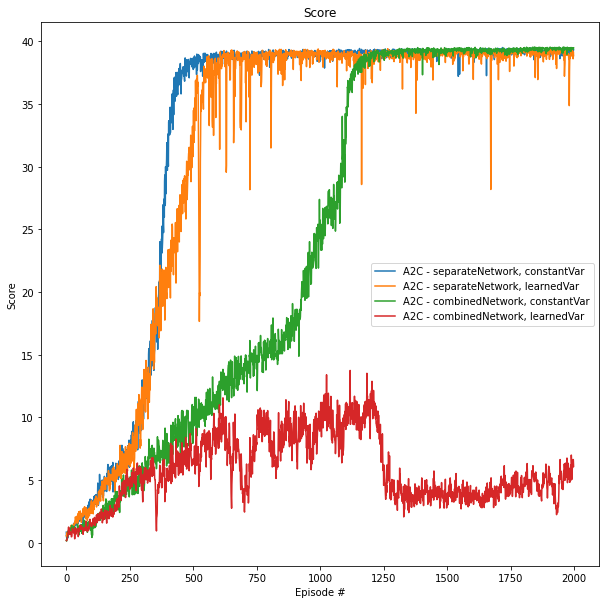
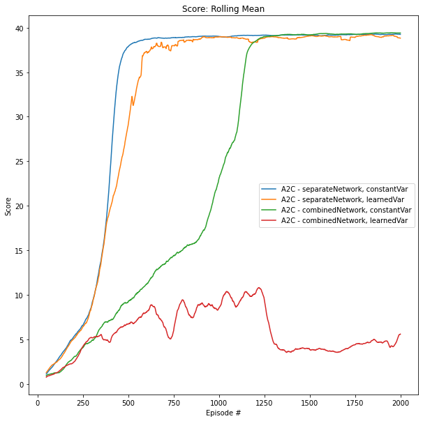

# Report

This report summarizes the implemented methods for the project **Continuous Control** of the Udacity course 
**Deep Reinforcement Learning**. 

## 1 Problem Statement

The goal of the project **Continuous Control** is to train multiple agents that are double-jointed robot arms to follow 
moving target regions. Below, we give a description of the problem statement.

We train the agents using reinforcement learning. 
Reinforcement learning is modeled as a Markov Decision Process, in which we have a 

- set of states $\mathcal{S}$,
- set of actions $\mathcal{A}$,
- a set of rewards,
- the one-step dynamics of the environment.

In the project **Continuous Control**, the observation space for each agent has 33 dimensions that represent the 
position, rotation, velocity, and angular velocities of the robot arm. Each agent has 4 continuous actions corresponding 
to the torque of the two joints. The torque values are limited between -1 and 1. Each agent receives a reward of +0.1 
for each time step its end effector is located inside the target region.

We aim to train the agents to interact with the environment such that the expected return, i.e., 
the (discounted) cumulative reward, is maximized. Thus, each agent's goal is to maintain the end effector location inside the 
target region for as many time steps as possible.

The task is episodic. The environment is solved, if the average score over all agents is at least +30 averaged over 100 
consecutive episodes.

## 2 Implementation Details

The implementation follows Algorithm S3 Asynchronous advantages actor-critic [[1]](#1). In contrast to [[1]](#1), we have 
implemented the synchronous version (also known as A2C). In A2C, we learn a policy using an actor network and an estimate 
of the value function using a critic network. We use multiple agents during training to improve the training stability. 
As in [[1]](#1), we add the entropy of the policy to the objective function for updating the actor network.

We have implemented and tested two different actor-critic architectures. The first architecture has separate networks
for the actor and critic as in [[1]](#1) for the continuous action control. The second architecture uses one network 
that combines the actor-critic output as in [[1]](#1) for experiments with discrete actions. The specific parameters for 
all networks can be found below.

In this project, the agents have continuous actions. We obtain those actions by sampling from a multidimensional Gaussian 
distribution that is parametrized by mean and variance, see also [[1]](#1). In the current implementation of the actor networks, 
the variance can be either learned or kept constant at 1 (see also [Shangtong Zhang's repository on deep RL](https://github.com/ShangtongZhang/DeepRL)). 
In the case the variance is learned, the actor network outputs two real number vectors representing the mean and scalar variance. 

The separate critic networks has two linear layers with ReLu activation functions, see the table below.

The combined actor-critic network has different output layers for the mean, variance, and the value estimate, see also 
the table below.

**Separate Actor Network**:

| Layer Nr.    | Input Size | Output Size | Activation Function |
|--------------|------------|-------------|---------------------|
| 1            | state size | 64          | ReLu                |
| 2            | 64         | 64          | ReLu                |
| 3.1 mean     | 64         | action size |                     |
| 3.2 variance | 64         | action size | SoftPlus            |

**Separate Critic Network**:

| Layer Nr. | Input Size | Output Size | Activation Function |
|-----------|------------|-------------|---------------------|
| 1         | state size | 64          | ReLu                |
| 2         | 64         | 64          | ReLu                |
| 3         | 64         | 1           |                     |

**Combined Actor-Critic Network**:

| Layer Nr.    | Input Size | Output Size | Activation Function |
|--------------|------------|-------------|---------------------|
| 1            | state size | 128         | ReLu                |
| 2            | 64         | 64          | ReLu                |
| 3.1 mean     | 64         | action size |                     |
| 3.2 variance | 64         | action size | SoftPlus            |
| 3.3 critic   | 64         | 1           |                     |

**A2C Parameters**:

| Parameter                                | Value |
|------------------------------------------|-------|
| Maximum number of time steps per episode | 10    |
| weight for entropy loss                  | 1e-5  | 
| learning rate                            | 1e-4  |
| discount factor                          | 0.99  | 

## 3 Evaluation

We trained the agent using all implemented architectures of the actor-critic networks, i.e.:

1. Separate Actor/Critic networks with constant variance
2. Separate Actor/Critic networks with learned variance
3. Combined Actor/Critic networks with constant variance
4. Separate Actor/Critic networks with learned variance

Variant 1 solves the project after 355 training episodes, and thus, having the fastest training times.
Variants 2 and 3 achieve similar scores than variant 1, but need more episodes to achieve comparable scores. 
Only variant 4 was not able to solve the project.

## 4 Future Work

There are several ways to improve the current implementation, which are listed below:

- Runtime optimization: the asynchronous version (A3C) could be implemented to improve on the training time.
- Hyperparameter tuning: the current hyperparameter values have not been extensively tuned. To improve the performance of the algorithm, tuning can be done as future work.

## References

<a id="1">[1]</a> 
Mnih, V. *et al.* 
**Asynchronous Methods for Deep Reinforcement Learning.**
*arXiv* **10.48550/ARXIV.1602.01783**, (2016).